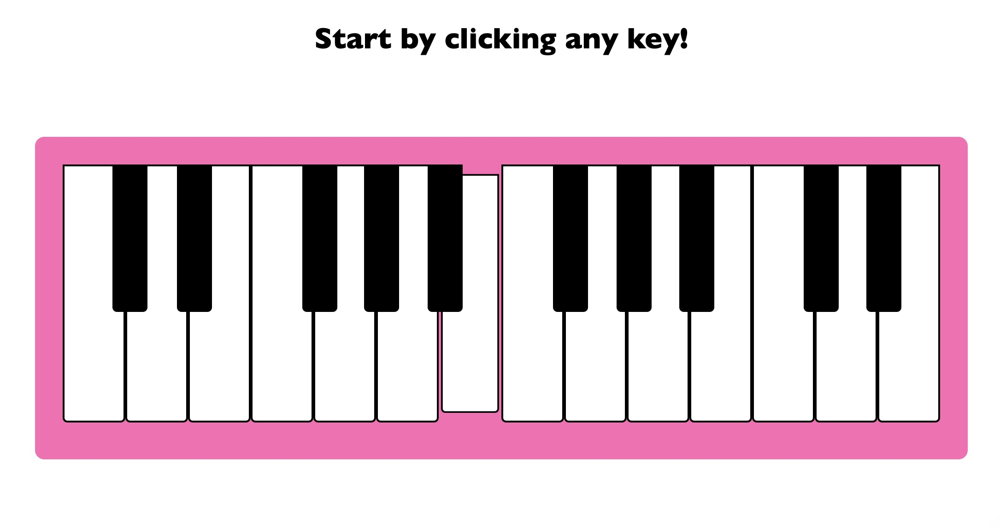

# Piano using JavaScript 🎮

A simple piano app built using JavaScript.

## Description 👩🏻‍💻

This project is a web-based piano application that allows users to play different piano keys by clicking on them. Each key produces a corresponding sound when clicked.

## Preview 👀

## Technologies Used 💻

- HTML
- CSS
- JavaScript

## Usage 🤷🏻‍♀️

1. Open the `index.html` file in a web browser.
2. Click on the piano keys to play the corresponding sounds.
3. Enjoy creating melodies and playing the piano!

## License ©️

This project is licensed under the [MIT License](LICENSE).
